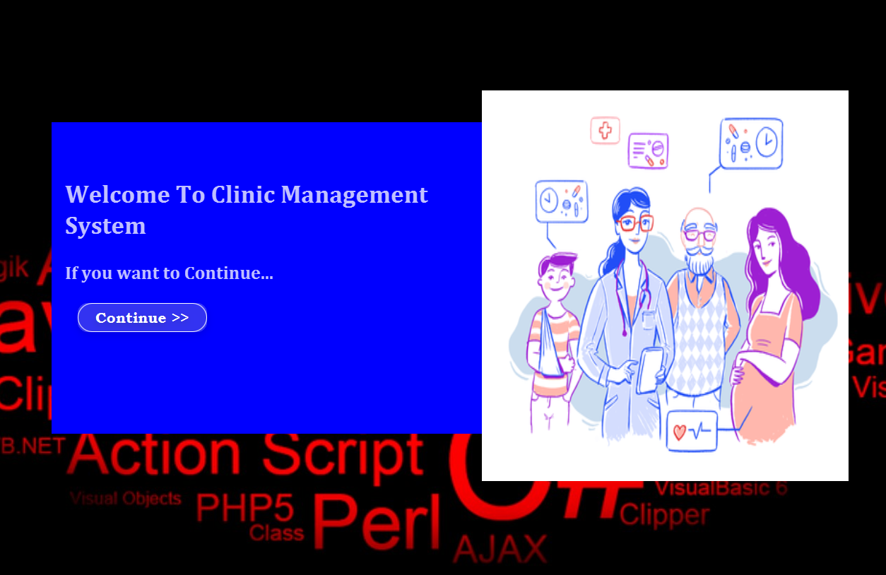

##Clinic Management System

--- This is the project that I created to a clinic in government sector to manage their details. This is my first semester final project ;

##Home Window

More Details of the project. 
functions of the project :-
 <li> Can Add patients  
 <li> Can Update patients 
 <li> Can Search patients Using Their Id Numbers  
 <li> Can Delete patients   
 <li> Can Add doctors  
 <li> Can Update doctors Details 
 <li> Can Search doctors using it id   
 <li> Can delete doctors 
 <li> Can Search patients In clinic wise  
 <li> Can give a medicine receipt to the patient with doctor details who examine that specific patient
 <li> Can admit eny clinic through the system 
 <li> Can discharge any patient of any clinic through the system
 <li> Can change a clinic of specific patient when doctors wants 
 <li> Can admit a patient to admit room from any clinic if its need 
 <li> Management can sea the history of each patients of all clinics with date wise and also with doctor details who examine patients a specific day 
 <li> Doctors can give the next clinic date for the patients through the system 
 <li> Doctors can sea the previous details about the patient through the system. 
    
  
Used Technologies are :-
 
<li> Language : Java
<li> UI Design : JavaFX
<li> Data Base : MySql
<li> Architecture : MVC
<li> Styles : CSS3
   
 